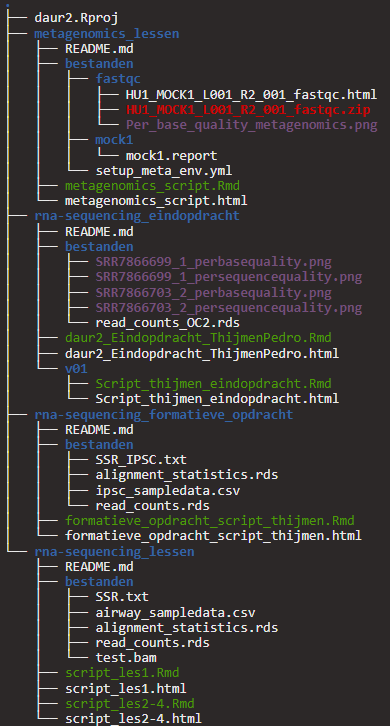

# Introduction

Welcome to my portfolio

In this github page I will show what I have learned in the past 4 months.

## Personality

Showing who I am, what experience I have and what skills I have learned is also important to show in a portfolio about me. So [here](https://thijmenvanbrenk.github.io/assignment04.html) you can see how I made my CV using RMarkdown.

To add to my experience I will be learning about shiny in a metagenomics environment, To show you how I want to develop myself in this branch I have made a planning that you can find [here]().

## Reproducability

Reproducability is an important part of data science because it makes sure the data is handled appropriately and its results can be accepted. People will also be able to use the same code for different experiments so they don't have to put in the time to make the same code again.

[here](https://thijmenvanbrenk.github.io/assignment01.html) you can see how I have used a dataset from a published report and performed a quick data-analysis to see if I could come up with the same results.

Checking if others are also publishing their raw data and code is also important for reproducible science, in [this page](https://thijmenvanbrenk.github.io/assignment02.html) shows you how I have ranked a random published paper on a the criteria for reproducibility.

Working reproducible also means having your files organized, [here](https://thijmenvanbrenk.github.io/assignment03.html) you can see how I have stored my files for a previous project.

To make sure I dont have to keep rewriting the same function (or copy pasting them from previous projects) its useful to be able to put these functions inside a package so you can use them all the time without any difficulty. being able to make those packages is a skill I am able to show you [here]()


## Extra skills

Writing introductions is a task that can't be taken lightly, finding the paper you want and making sure to not copy paste their information is a hard task. in [this]() text file you will find the introduction to one of my projects, and what you will see is an introduction that has a few references and the information from those references has been written in my own words. A good skill for a researcher.

Using datasets is very common in the data science department, so using a database like PostgreSQL is prefered. but talking to DBeaver requires talking in SQL. in [this]() page you can see that I am capable of communicating with DBeaver using SQL.

Having to keep writing the same information for every table and figure like date and origin will become a tedious job if you have a few tables and figures to go through. to make this an easier task I can show you [here]() how using parameters will make writing information for tables and figures easier. 

If you want to see how i made this HTML please check out my [portfolio github repository](https://github.com/Thijmenvanbrenk/Portfolio) for the original code, and to see which data and which pictures i have used you can check out my [data folder](https://github.com/Thijmenvanbrenk/Portfolio/tree/main/data)

<!--chapter:end:index.Rmd-->

---
title: "CV"
author: "Thijmen van Brenk"
date: "2022-05-30"
output: html_document
---
# Personality

Because making the CV uses special headers its not possible to knit it into bookdown, thats why this is just the picture of the CV. the orginal code can be found in this repository at: "data/CV_thijmenvanbrenk.Rmd"


<!--chapter:end:01-CV.Rmd-->

---
title: "Amount of offspring for C. elegans incubated in different substances"
author: "Thijmen van Brenk"
date: "2022-05-30"
output: bookdown::render_book()
---

# Reproducability

## Reproducing data from a published paper

Here i am showing you how i am able to reproduce results from a published paper    
the data used in this assignment comes from [@vandervoetReportingGuidelineDevelopmental2021]


```r
library(tidyverse)
library(here)
library(readxl)
library(rbbt)
library(RColorBrewer)
```


```r
offspring <- read_excel(here("data/CE.LIQ.FLOW.062_Tidydata.xlsx"), sheet = 1)

# we want to see if the data for the experimental conditions have been imported correctly
offspring %>% select(c("expType", "RawData", "compName", "compConcentration"))
```

```
## # A tibble: 360 x 4
##    expType    RawData compName                   compConcentration
##    <chr>        <dbl> <chr>                      <chr>            
##  1 experiment      44 2,6-diisopropylnaphthalene 4.99             
##  2 experiment      37 2,6-diisopropylnaphthalene 4.99             
##  3 experiment      45 2,6-diisopropylnaphthalene 4.99             
##  4 experiment      47 2,6-diisopropylnaphthalene 4.99             
##  5 experiment      41 2,6-diisopropylnaphthalene 4.99             
##  6 experiment      35 2,6-diisopropylnaphthalene 4.99             
##  7 experiment      41 2,6-diisopropylnaphthalene 4.99             
##  8 experiment      36 2,6-diisopropylnaphthalene 4.99             
##  9 experiment      40 2,6-diisopropylnaphthalene 4.99             
## 10 experiment      38 2,6-diisopropylnaphthalene 4.99             
## # ... with 350 more rows
```

```r
# as we can see, the rawdata should have been an integer, the compname and expType should have been a factor and the compconcentration should have been a double. lets change that

offspring$RawData <- as.integer(offspring$RawData)
offspring$compName <- as.factor(offspring$compName)
offspring$expType <- as.factor(offspring$expType)

offspring_tidy <- offspring
offspring_tidy$compConcentration <- as.numeric(offspring_tidy$compConcentration)

# one of the values in compconcentration is accidentally classified as a character in excel and has now turned into a NA value, we will change this value manually.

character_placement <- which(is.na(offspring_tidy$compConcentration))
character_value <- offspring$compConcentration[character_placement] %>% str_replace(",", ".") %>% parse_number()
offspring_tidy$compConcentration[character_placement] <- character_value

# lets check one last time if the data types are correct.
offspring %>% select(c("RawData", "compName", "compConcentration"))
```

```
## # A tibble: 360 x 3
##    RawData compName                   compConcentration
##      <int> <fct>                      <chr>            
##  1      44 2,6-diisopropylnaphthalene 4.99             
##  2      37 2,6-diisopropylnaphthalene 4.99             
##  3      45 2,6-diisopropylnaphthalene 4.99             
##  4      47 2,6-diisopropylnaphthalene 4.99             
##  5      41 2,6-diisopropylnaphthalene 4.99             
##  6      35 2,6-diisopropylnaphthalene 4.99             
##  7      41 2,6-diisopropylnaphthalene 4.99             
##  8      36 2,6-diisopropylnaphthalene 4.99             
##  9      40 2,6-diisopropylnaphthalene 4.99             
## 10      38 2,6-diisopropylnaphthalene 4.99             
## # ... with 350 more rows
```

```r
# they are so we can now use the data for further analysis
```


```r
offspring_tidy %>%
  ggplot(aes(x = log10(compConcentration + 0.0001), y = RawData)) +
  geom_jitter(aes(shape = expType, colour = compName), width = .1) +
  labs(title = "Amount of offspring from C. elegans incubated in different substances",
       subtitle = "Experiment data from (van der Voet et al. 2021)",
       x = "Log 10 of compound concentration",
       y = "Amount of offspring per C. elegans",
       colour = "Compound name",
       shape = "Experiment type") +
  scale_shape_discrete(labels = c("Negative control", "Positive control", "Vehicle A control", "Experiment")) +
  scale_colour_brewer(palette = "Dark2") +
  theme_classic()
```


the positive control of this experiment is Ethanol and the negative control is no added substance.
<br>
<br>
<br>
to analyze this experiment I would follow these steps.       
1. making a new column which shows which condition every worm is located in. (for example, group1 would consist of 2,6-diisopropylnaphthalene with a concentration of 4.99 nM, etc.)       
2. checking normality for every condition.        
<br>
_NORMALLY DISTRIBUTED DATA:_        
3. perform ANOVA. with post-hoc tests and check if they differ from the control.       
_NOT NORMALLY DISTRIBUTED DATA:_        
3. perform kruskal - wallis test.       
<br>
4. to visualize this difference, make a smoothed line graph for every the mean of every concentration per substance.        
5. compare these graphs with each other.


```r
normalized_value <- offspring_tidy %>% 
  group_by(compName) %>% filter(compName == "S-medium") %>%
  summarise(mean = mean(RawData, na.rm = T))

offspring_tidy <- offspring_tidy %>% mutate(normalized_offspring = 
                                              RawData/normalized_value$mean)


offspring_tidy %>%
  ggplot(aes(x = log10(compConcentration + 0.0001), y = normalized_offspring)) +
  geom_jitter(aes(shape = expType, colour = compName), width = .1) +
  labs(title = "Amount of offspring from C. elegans incubated in different substances",
       subtitle = "Experiment data from (van der Voet et al. 2021)",
       x = "Log 10 of compound concentration",
       y = "Normalized offspring amount by mean of negative control",
       colour = "Compound name",
       shape = "Experiment type") +
  scale_shape_discrete(labels = c("Negative control", "Positive control", "Vehicle A control", "Experiment")) +
  scale_colour_brewer(palette = "Dark2") +
  theme_classic()
```


      
  We normalize the data so we can see the difference between the different substances more easily.

<!--chapter:end:02-data_from_paper.Rmd-->

---
title: "Open peer review of data about the toxicology of pesticedes for bees"
author: "Thijmen van Brenk"
date: "2022-05-30"
output: bookdown::html_document2
---

## Checking reproducability for published papers.

in this assignment, this study [@stroblPositiveCorrelationPesticide2020] will be graded on the criteria for reproducibility.       
and this study [@brewerDiscrepantFindingsRelation2021] will be graded on code readability and reproducibility.
<br>
<br>


### Pesticide influence on consumption rate and survival for bees. 

* introduction of the paper          

the use of pesticides is one of the main reasons of loss of biodiversity, and the combination of multiple pesticides could even make this worse. in this experiment it is investigated what the sublethal (food consumption) and the lethal (survival) effects of pesticides are on adult female solitary bees, *Osmia bicornis*.       
<br>
to perform these tests, female solitary bees were divided into 4 groups:   

-- pesticide free (control)     
-- herbicide      
-- pesticide      
-- combined (both herbicide and pesticide)      
their consumption rate and longevity were measured and the data from these two variables are used for analysis.
<br>
<br>
there is no significant difference in survival and consumption between te different groups. there is however a significant positive correlation between the consumption rate and the longevity of these bees.


* transparancy criteria grading

| transparancy<br>criteria | grading                                        |
|--------------------------|------------------------------------------------|
| study purpose            | TRUE                                           |
| data<br>availability     | FALSE<br>only part of the data is<br>available |
| data <br>location        | at the beginning/<br>at the end                |
| study<br>location        | TRUE<br>materials/methods                      |
| author<br>review         | location and email<br>are present at the top   |
| ethics<br>statement      | FALSE                                          |
| funding<br>statement     | TRUE                                           |
| code<br>availability     | TRUE                                           |

The part of the data that is available can be accessed through this directory: "data/insects-957898-supplementary.xlsx"

### impact of analysis decisions for episodic memory and retrieval practices.

we will solely focus on the code of this paper to see:       
-- If the code can be understood easily.       
-- If I can reproduce one of the figures.        
-- If there are any bugs/flaws in the code.       

the code is available <span style="color:blue">[in this website](https://osf.io/dgcaz/)</span>        

the code has been copied to a new Rmd file in this repository under the name "_analysis_decisions_code.Rmd"        
the data has been downloaded and is available in this repository under the name "data/AllDataRR.csv"        
<br>        

* changes made:       

-- changed the directory in line 11 so it retrieved the data used from this study.        
-- installed the packages in line 19 and line 180.        
<br>        

* first impression:   

-- (+) every test is in different chunks which makes readability easier.       
-- (+) clear comments on what is happening.       
-- (+) easy to understand code        
-- (-) chunks dont have names.       
-- (-) the individual results are far away from each other.       
-- (-) the same tests are set of tests are performed multiple times, making a function would make chances of mistakes less likely
<br>        

* what this code is trying to achieve      

the first part of the code for this experiment is looking for the correlation between individual and different studies (line 24-174)       
the second part of the code for this experiment is looking at a correlation between the retrieval practice effect and the EM ability with the help of a graph. there are 2 graphs, one where everything is mean centered and one where it isnt.        
<br>        

* final judgement: (grading goes from 1-5(1 very hard/bad- 5 very easy/good))     

-- readability = 4        
-- reproducability = 5        
-- efficiency = 2       

<!--chapter:end:03-grading_reproducability.Rmd-->

---
title: ""
author: "Thijmen van Brenk"
output: bookdown::html_document2
---

## organisation of my files

to show my ability at organizing files heres an example of the file structure from one of my previous projects


<!--chapter:end:04-file_orgainization.Rmd-->

