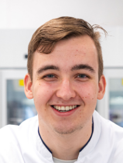

```{r, include=FALSE}
blank_lines <- function(n = 10){cat(rep("&nbsp;  ",n), sep="\n")}

```


Aside
================================================================================
{width=80%}


Extra Informatie {#contact}
--------------------------------------------------------------------------------

- <i class="fa fa-envelope"></i> tvanbrenk@outlook.com
- <i class="fa fa-github"></i> [github.com/thijmenvanbrenk](https://github.com/thijmenvanbrenk)
- <i class="fa fa-phone"></i> 06 387 349 75
- <i class="fa fa-car"></i> Rijbewijs B
- <i class="fa fa-flag"></i> Nederlands
- Voor meer informatie ben ik bereikbaar via mijn email


Talenkennis {#skills}
--------------------------------------------------------------------------------

- Nederlands: Moedertaal
- Engels: Vloeiend

Competenties
--------------------------------------------------------------------------------

- Stressbestendig
- Hardwerkend
- Zelfstandig
- Doorzettingsvermogen
- Loyaal

Disclaimer {#disclaimer}
--------------------------------------------------------------------------------


deze CV is gemaakt met de R package [**pagedown**](https://github.com/rstudio/pagedown).            
Laatst geupdate op: `r Sys.Date()`.


Main
================================================================================

Thijmen van Brenk {#title}
--------------------------------------------------------------------------------

### Persoonsgegevens

Voornaam:  &nbsp;&nbsp;&nbsp;&nbsp;&nbsp;&nbsp;&nbsp;&nbsp;&nbsp;&nbsp;  Thijmen       
Achternaam: &nbsp;&nbsp;&nbsp;&nbsp;&nbsp;&nbsp;&nbsp;    Van Brenk           
Adres:      &nbsp;&nbsp;&nbsp;&nbsp;&nbsp;&nbsp;&nbsp;&nbsp;&nbsp;&nbsp;&nbsp;&nbsp;&nbsp;&nbsp;&nbsp;&nbsp;&nbsp;             Tolsestraat 23       
&nbsp;&nbsp;&nbsp;&nbsp;&nbsp;&nbsp;&nbsp;&nbsp;&nbsp;&nbsp;&nbsp;&nbsp;&nbsp;&nbsp;&nbsp;&nbsp;&nbsp;&nbsp;&nbsp;&nbsp;&nbsp;&nbsp;&nbsp;&nbsp;&nbsp;&nbsp;&nbsp;&nbsp;&nbsp;    4043 KB Opheusden            
Geboortedatum: &nbsp;&nbsp;     27 April 2002           
Geboorteplaats: &nbsp;&nbsp;    Nijmegen            
Geslacht: &nbsp;&nbsp;&nbsp;&nbsp;&nbsp;&nbsp;&nbsp;&nbsp;&nbsp;&nbsp;&nbsp;&nbsp;&nbsp;    Man           


Opleidingen {data-icon=graduation-cap data-concise=true}
--------------------------------------------------------------------------------

### Biologie en medisch laboratorium onderzoek

Hogeschool Utrecht

Utrecht, NL

heden - 2019

- *Specialisatiekeuze:* Microbiologie
- *Minor:* Data science for biologiy 1-2
- *Projecten:*
- Determinatie en biofilm assay van bacteriën bij Quaker Houghton
- PCR validatie voor *Porphyromonas gingivalis*

### HAVO Profiel N&G, N&T

Ichthus College

Veenendaal, NL

2019 - 2014


Werk ervaring {data-icon=suitcase}
--------------------------------------------------------------------------------

### Administratief medewerker

Ziekenhuis gelderse vallei

Ede, NL

Heden - 2021

- Inboeken patientmaterialen met behulp van XCARE en GLIMS
- Inzetten patientmaterialen
- Lab materialen bijvullen en HAP pakketten maken

### Medewerker kuikenbroederij

Het anker pluimveehouderij

Ochten, NL

2022 - 2014

:::concise
- Kamers schoonmaken en ontsmetten
- Kuiken sorteren op geslacht
- Kuikens enten
:::

### Vakkenvuller

Albert Heijn

Opheusden, NL

2019 - 2017

:::concise
- Vakken vullen
- Klanten assisteren
:::

Cursussen
--------------------------------------------------------------------------------

### Bijenhouden voor gevorderden

Imkers Oost-betuwe

Bemmel, NL

heden - 2019


### Bijenhouden voor beginners

Imkers Oost-betuwe

Bemmel, NL

2019 - 2018


