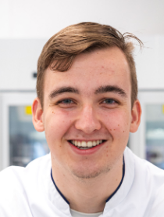

Aside
================================================================================
{width=80%}


Extra Information {#skills}
--------------------------------------------------------------------------------

- <i class="fa fa-envelope"></i> tvanbrenk@outlook.com
- <i class="fa fa-github"></i> [github.com/thijmenvanbrenk](https://github.com/thijmenvanbrenk)
- <i class="fa fa-phone"></i> 06 387-349-75
- <i class="fa fa-car"></i> Driver license BE
- <i class="fa fa-flag"></i> Dutch


Languages {#skills}
--------------------------------------------------------------------------------

- Dutch: Mother tongue
- English: Fluently
- German: limited

Skills {#skills}
--------------------------------------------------------------------------------

- Stress resistent
- Hard working
- independent
- Perseverant
- Loyal

<br/>           
<br/>

Disclaimer {#disclaimer}
--------------------------------------------------------------------------------


This CV is made using the R package [**pagedown**](https://github.com/rstudio/pagedown).            
Updated on: `r Sys.Date()`.


Main
================================================================================

Thijmen van Brenk {#title}
--------------------------------------------------------------------------------

### Personal details

```{css making a table, echo=FALSE}

table {   border-collapse: separate;   border-spacing: 15px 0;  }
```


<table> 
  <tr> 
    <td> First name: </td> 
    <td> Thijmen </td> 
  </tr> 
  <tr> 
    <td> Surname: </td> 
    <td> van Brenk </td> 
  </tr>
  <tr> 
    <td> Address: </td> 
    <td> Tolsestraat 23 </td> 
  </tr> 
  <tr> 
    <td>  </td> 
    <td> 4043KB Opheusden </td> 
  </tr> 
    <tr> 
    <td> Day of birth: </td> 
    <td> 27/04/2002 </td> 
  </tr> 
  <tr> 
    <td> Birth city: </td> 
    <td> Nijmegen </td> 
  </tr>
  <tr> 
    <td> Sex: </td> 
    <td> Man </td> 
  </tr> 
</table>


Education {data-icon=graduation-cap data-concise=true}
--------------------------------------------------------------------------------

### Biologie en medisch laboratoriumonderzoek

Hogeschool Utrecht

Utrecht, NL

2023 - 2019

- *Specialization:* Microbiology
- *Minor:* Data science for biology 1-2
- *Projects:*            
&nbsp;&nbsp;&nbsp;&nbsp;- Identification of host associated genes for *Campylobacter jejuni* and &nbsp;&nbsp;&nbsp;&nbsp;&nbsp; *Campylobacter coli* (Utrecht university)         
&nbsp;&nbsp;&nbsp;&nbsp;- Determination and biofilm assay for Quaker Houghton           
&nbsp;&nbsp;&nbsp;&nbsp;- PCR validation for *Porphyromonas gingivalis*

### HAVO Profile N&G, N&T

Ichthus College

Veenendaal, NL

2019 - 2014


Work experience {data-icon=suitcase}
--------------------------------------------------------------------------------
### Micriobiological technician

Dicoon

Ede, NL

Current - 2023

- Inoculating patient samples for bacterial determination.
- Serological testing of patient samples for viral, bacterial, mycological and parasitical pathogens.

### Adminstrative employee

Dicoon (Formerly part of Ziekenhuis Gelderse Vallei)

Ede, NL

2023 - 2021

- Accepting patient samples and creating orders with XCARE and GLIMS
- Creating packages for General practitioners

### Hatchery employee

Kuikenbroederij en Pluimveebedrijf Het Anker BV

Ochten, NL

2022 - 2014

:::concise
- Cleaning and decontaminating rooms
- Sorting chicks based on sex
- Vacinating chicks
:::


Courses
--------------------------------------------------------------------------------


### Beekeeping for beginners

Imkers Oost-Betuwe

Bemmel, NL

2019 - 2018


